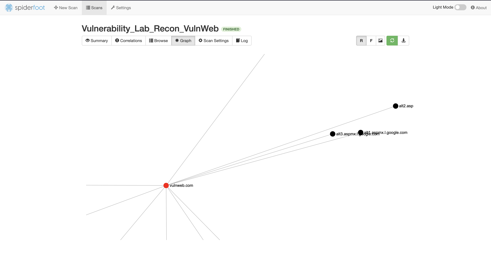

# OSINT Project: Attack Surface Mapping of VulnWeb

## 🎯 Overview
This project demonstrates an automated reconnaissance exercise conducted against `vulnweb.com`. As a senior cybersecurity student, I used this to practice mapping organizational infrastructure and identifying technology stacks using passive OSINT techniques.

## 🛠 Methodology
- **Tools:** SpiderFoot (running in a dedicated Python 3.11 Conda environment on macOS).
- **Techniques:** Recursive DNS brute-forcing, web metadata extraction, and service banner grabbing.
- **Approach:** Strictly passive to ensure zero-impact on target availability.

## 📊 Infrastructure Visualization

*Relationship map showing DNS authority, Mail servers, and discovered subdomains.*

## 🔍 Key Findings
- **Subdomain Enumeration:** Identified `testaspnet`, `testasp`, and `testhtml5` subdomains.
- **Technology Fingerprinting:** Target is utilizing **Nginx 1.19.0**, **ASP.NET**, and **AngularJS**.
- **Email/DNS Logic:** Mapped 5 Google MX records and Gandi.net name servers.

## 📂 Project Artifacts
- `recon_results.csv`: Full intelligence dataset.
- `network_graph.gexf`: Graph data for advanced visualization.
